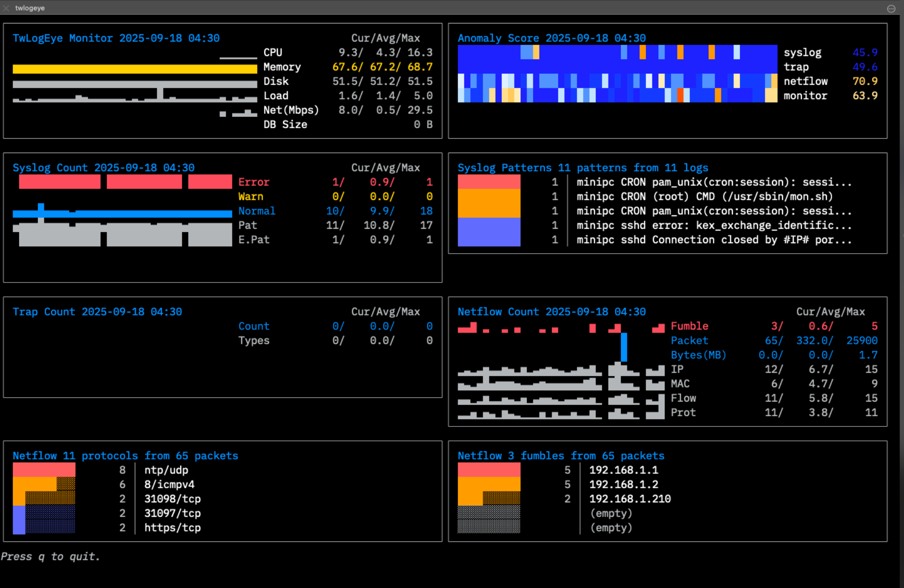
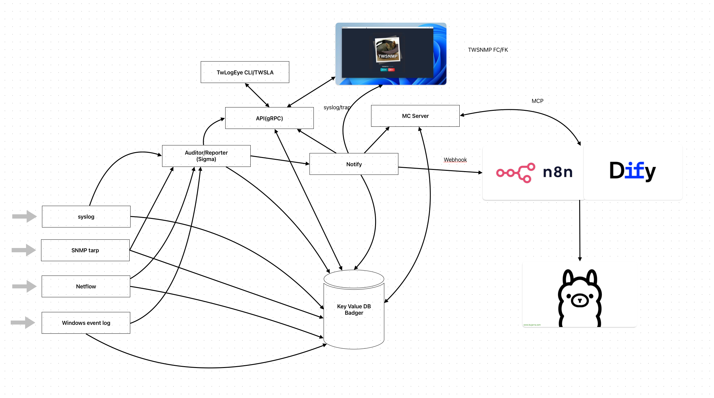

# twlogeye

[日本語のREADME](README-ja.md)

### AI-Powered Lightweight Log Server & Intelligent Monitoring



**TwLogEye** is a next-generation log server that goes beyond simple storage. It integrates AI to analyze, categorize, and detect anomalies in real-time, turning raw logs into actionable intelligence.

🤖 AI-Driven Anomaly Detection: High-performance scoring for Syslog, Trap, and Netflow. 

📊 Visual Log Clustering: Automatically group similar logs into patterns for faster troubleshooting. 

🚀 Resource Efficient: Real-time monitoring with minimal CPU/Memory footprint. 

SIGMA Rules

https://github.com/SigmaHQ/sigma

can be directly loaded for threat detection.
It supports MCP servers and assists AI in log analysis.
Notifications can be sent to AI-enabled automation tools via webhooks.
Machine learning enables anomaly detection from logs.

Supported log formats include:

- syslog
- SNMP Trap
- Netflow
- Windows Event log (Windows environments only)


The system configuration is

.


We use Badger, a high-speed Key/Value Store built in Go, for storing logs and reports. This enables us to store tens of thousands of logs per second, amounting to several terabytes.


## Install

It is recommended to install on Linux/Mac OS with a shell script.

```terminal
$curl -sS https://lhx98.linkclub.jp/twise.co.jp/download/install_twlogeye.sh | sh
```

Linux/Mac OS can be installed via Homebrew.

```terminal
$brew install twsnmp/tap/twlogeye
```

Linux packages are also available for release.

https://github.com/twsnmp/twlogeye/releases


Windows downloads are available as zip files from the releases or can be installed via scoop.

```terminal
>scoop bucket add twsnmp https://github.com/twsnmp/scoop-bucket
>scoop install twlogeye
```

## Docker

How to start the Docker version

```
$mkdir ./twlogeye
$vi  ./twlogeye/config.yaml #Edit Config
$docker run --rm -v ./twlogeye:/datastore \
-p 2055:2055/udp -p 514:514/udp -p 162:162/udp -p 1883:1883 \
-e TZ=Asia/Tokyo twsnmp/twlogeye
```
Please create config.yaml.

The dashboard display is
```
$docker exec -it <container ID> /twlogeye dashboard \
monitor anomaly netflow.count mqtt.count
```


## Basic usage

- Create log and sigma rule directory.
- Create config file.
- Copy or create sigma rules to sigma rule directory
- Start server.

```
~$mkdir logs
~$mkdir sigma
~$code twlogeye.yaml
~$cp <sigma rules> sigma
~$twlogeye start
```

## Command explanation

[Command system](cli-map.md)

[Illustration of command system](cli-map-v.html)


You can check the commands that support the Help command.

```terminal
$twlogeye help
AI-Native log server to monitor threats in logs with sigma rules
Supported logs are
- syslog
- SNMP trap
- NetFlow/IPFIX
- Windows event log
- OpenTelemetry
- MQTT
You can find sigma rule here.
https://github.com/SigmaHQ/sigma

Support MCP server and webhook notify for AI

Usage:
  twlogeye [command]

Available Commands:
  clear       Clear DB of twlogeye
  completion  Generate the autocompletion script for the specified shell
  dashboard   Display twlogeye dashboard
  gencert     Generate TLS private key and cert
  help        Help about any command
  log         Search log
  notify      Search notify
  otel        Get OpenTelemetry info
  reload      Reload rules
  report      Get report
  sigma       Check sigma rules (list|stat|logsrc|field|check|test)
  start       Start twlogeye
  stop        Stop twlogeye
  version     Show twlogeye version
  watch       Watch notify

Flags:
  -p, --apiPort int         API Server port (default 8081)
      --apiServer string    server IP or host name (default "localhost")
      --caCert string       API CA cert
      --clientCert string   API client cert
      --clientKey string    API client private key
      --config string       config file (default is ./twlogeye.yaml)
  -h, --help                help for twlogeye
      --serverCert string   API server cert
      --serverKey string    API server private key

Use "twlogeye [command] --help" for more information about a command.
```

### Server
#### start command

```terminal
$twlogeye help start
Start twlogeye

Usage:
  twlogeye start [flags]

Flags:
      --anomalyNotifyDelay int         Grace period for sending notifications when detecting anomalies (default 24)
      --anomalyReportThreshold float   anomaly report threshold
      --anomalyUseTime                 Include weekends and hours in the vector data for anomaly detection
  -d, --dbPath string                  DB Path default: memory
      --debug                          debug mode
      --geoIPDB string                 Geo IP Database Path
      --grokDef string                 GROK define file
      --grokPat string                 GROK patterns
  -h, --help                           help for start
      --keyValParse                    Splunk Key value parse
      --logRetention int               log retention(hours) (default 48)
      --mcpEndpoint string             MCP server endpoint
      --mcpFrom string                 MCP server from ip address list
      --mcpToken string                MCP server token
      --mibPath string                 SNMP Ext MIB Path
      --mqttCert string                MQTT server certificate
      --mqttFrom string                MQTT client IPs
      --mqttKey string                 MQTT server private key
      --mqttTCPPort int                MQTT TCP Port
      --mqttUsers string               MQTT user and password
      --mqttWSPort int                 MQTT Websock Port
      --namedCaptures string           Named capture defs path
      --netflowPort int                netflow port 0=disable
      --notifyRetention int            notify retention(days) (default 7)
      --otelCA string                  OpenTelemetry CA certificate
      --otelCert string                OpenTelemetry server certificate
      --otelFrom string                OpenTelemetry client IPs
      --otelHTTPPort int               OpenTelemetry HTTP Port
      --otelKey string                 OpenTelemetry server private key
      --otelRetention int              log retention(hours) (default 48)
      --otelgRPCPort int               OpenTelemetry gRPC Port
      --reportInterval int             report interval (minute) (default 5)
      --reportRetention int            report retention(days) (default 7)
      --reportTopN int                 report top n (default 10)
      --resolveHostName                Resolve Host Name
      --sigmaConfigs string            SIGMA config path
      --sigmaRules string              SIGMA rule path
      --sigmaSkipError                 Skip sigma rule error
      --sjis                           Windows eventlog SHIFT-JIS mode
      --syslogDst string               syslog dst
      --syslogTCPPort int              syslog TCP port 0=disable
      --syslogUDPPort int              syslog UDP port 0=disable
      --trapCommunity string           SNMP TRAP Community
      --trapDst string                 SNMP TRAP dst
      --trapPort int                   SNMP TRAP receive port 0=disable
      --webhookDst string              Webhook dst URL
      --winAuth string                 Windows eventlog auth
      --winEventLogChannel string      Windows eventlog channel
  -i, --winEventLogCheckInterval int   Windows eventlog check interval
  -s, --winEventLogCheckStart int      Windows eventlog check start time (hours)
      --winPassword string             Windows eventlog password
      --winUser string                 Windows eventlog user

Global Flags:
  -p, --apiPort int         API Server port (default 8081)
      --apiServer string    server IP or host name (default "localhost")
      --caCert string       API CA cert
      --clientCert string   API client cert
      --clientKey string    API client private key
      --config string       config file (default is ./twlogeye.yaml)
      --serverCert string   API server cert
      --serverKey string    API server private key
```


### Client
#### log command

```terminal
$twlogeye help log

Search log via api

Usage:
  twlogeye log [flags]

Flags:
      --end string       end date and time
  -h, --help             help for log
      --logtype string   log type  (default "syslog")
      --search string    search text
      --start string     start date and time

Global Flags:
  -p, --apiPort int         API Server port (default 8081)
      --apiServer string    server IP or host name (default "localhost")
      --caCert string       API CA cert
      --clientCert string   API client cert
      --clientKey string    API client private key
      --config string       config file (default is ./twlogeye.yaml)
      --serverCert string   API server cert
      --serverKey string    API server private key
```

#### notify command
```terminal
$twlogeye help notify
Search notify via api

Usage:
  twlogeye notify [flags]

Flags:
      --end string     notify level
  -h, --help           help for notify
      --level string   notify level
      --start string   start date and time

Global Flags:
  -p, --apiPort int         API Server port (default 8081)
      --apiServer string    server IP or host name (default "localhost")
      --caCert string       API CA cert
      --clientCert string   API client cert
      --clientKey string    API client private key
      --config string       config file (default is ./twlogeye.yaml)
      --serverCert string   API server cert
      --serverKey string    API server private key

```

#### watch command
```
$twlogeye help watch 
Watch notify via api

Usage:
  twlogeye watch [flags]

Flags:
  -h, --help   help for watch

Global Flags:
  -p, --apiPort int         API Server port (default 8081)
      --apiServer string    server IP or host name (default "localhost")
      --caCert string       API CA cert
      --clientCert string   API client cert
      --clientKey string    API client private key
      --config string       config file (default is ./twlogeye.yaml)
      --serverCert string   API server cert
      --serverKey string    API server private key
```

#### report command

get report

```
$twlogeye help report
Get report via api

Usage:
  twlogeye report <report type> [<anomaly type>] [flags]

Flags:
      --end string     end date and time
  -h, --help           help for report
      --noList         report summary only
      --start string   start date and time

Global Flags:
  -p, --apiPort int         API Server port (default 8081)
      --apiServer string    server IP or host name (default "localhost")
      --caCert string       API CA cert
      --clientCert string   API client cert
      --clientKey string    API client private key
      --config string       config file (default is ./twlogeye.yaml)
      --serverCert string   API server cert
      --serverKey string    API server private key
```

### dashboard command

Display dashboard.


```terminal
$twlogeye help dashboard
Display twlogeye dashboard.
<panel type> is
  monitor | anomaly
  syslog.count | syslog.pattern | syslog.error
  trap.count | trap.type
  netflow.count | netflow.ip.packet | netflow.ip.byte | netflow.mac.packet | netflow.mac.byte
  netflow.flow.packet | netflow.flow.byte | netflow.fumble | netflow.prot
  netflow.host | netflow.loc | netflow.country
  winevent.count | winevent.pattern | winevent.error
  otel.count | otel.pattern | otel.error | otel.metric.<id>
  mqtt.count | mqtt.type

Usage:
  twlogeye dashboard <panel type>... [flags]

Flags:
  -h, --help          help for dashboard
      --history int   Keep report history (default 100)
      --topn int      Number of top n lines. (default 5)

Global Flags:
  -p, --apiPort int         API Server port (default 8081)
      --apiServer string    server IP or host name (default "localhost")
      --caCert string       API CA cert
      --clientCert string   API client cert
      --clientKey string    API client private key
      --config string       config file (default is ./twlogeye.yaml)
      --serverCert string   API server cert
      --serverKey string    API server private key
```

#### otel Command

OpenTelemetryのメトリック、トレースを取得するコマンドです。

```
$twlogeye help otel
Get OpenTelemetry info via api

Usage:
  twlogeye otel <metric|trace> <list|id> [flags]

Flags:
  -h, --help   help for otel

Global Flags:
  -p, --apiPort int         API Server port (default 8081)
      --apiServer string    server IP or host name (default "localhost")
      --caCert string       API CA cert
      --clientCert string   API client cert
      --clientKey string    API client private key
      --config string       config file (default is ./twlogeye.yaml)
      --serverCert string   API server cert
      --serverKey string    API server private key
```


#### stop command
```
$twlogeye help stop
Stop twlogeye via api

Usage:
  twlogeye stop [flags]

Flags:
  -h, --help   help for stop

Global Flags:
  -p, --apiPort int         API Server port (default 8081)
      --apiServer string    server IP or host name (default "localhost")
      --caCert string       API CA cert
      --clientCert string   API client cert
      --clientKey string    API client private key
      --config string       config file (default is ./twlogeye.yaml)
      --serverCert string   API server cert
      --serverKey string    API server private key
```

#### reload command

```
$twlogeye help reload
Reload rules via api

Usage:
  twlogeye reload [flags]

Flags:
  -h, --help   help for reload

Global Flags:
  -p, --apiPort int         API Server port (default 8081)
      --apiServer string    server IP or host name (default "localhost")
      --caCert string       API CA cert
      --clientCert string   API client cert

```

#### clear command

Clear logs ,notify report on DB. 

```
$twlogeye help clear
Clear DB of twlogeye via api type is "logs","notify","report"

Usage:
  twlogeye clear <type> <subtype> [flags]

Flags:
  -h, --help   help for clear

Global Flags:
  -p, --apiPort int         API Server port (default 8081)
      --apiServer string    server IP or host name (default "localhost")
      --caCert string       API CA cert
      --clientCert string   API client cert
      --clientKey string    API client private key
      --config string       config file (default is ./twlogeye.yaml)
      --serverCert string   API server cert
      --serverKey string    API server private key
```


### Util
#### gencert command

```
＄twlogeye  help gencert
Generate TLS private key and cert for gRPC server/client

Usage:
  twlogeye gencert [flags]

Flags:
      --cn string   CN for client cert (default "twsnmp")
  -h, --help        help for gencert

Global Flags:
  -p, --apiPort int         API Server port (default 8081)
      --apiServer string    server IP or host name (default "localhost")
      --caCert string       API CA cert
      --clientCert string   API client cert
      --clientKey string    API client private key
      --config string       config file (default is ./twlogeye.yaml)
      --serverCert string   API server cert
      --serverKey string    API server private key

```

Generate client cert and key.
```terminal
$twlogeye gencert --clientCert c.crt --clientKey k.key
```
Generate server cert and key.
```terminal
$twlogeye gencert --serverCert s.crt --serverKey s.key
```

#### sigma command

```terminal
Check sigma rules (list|stat|logsrc|field|check|test)
	directory: list rules
	stat: stat rules
	logsrc: list log sources
	field: list fields
	check: check rule
	test: test rule args

Usage:
  twlogeye sigma [flags]

Flags:
  -h, --help                help for sigma
      --sigmaRules string   SIGMA rule path

Global Flags:
  -p, --apiPort int         API Server port (default 8081)
      --apiServer string    server IP or host name (default "localhost")
      --caCert string       API CA cert
      --clientCert string   API client cert
      --clientKey string    API client private key
      --config string       config file (default is ./twlogeye.yaml)
      --serverCert string   API server cert
      --serverKey string    API server private key
```

## MCP Server Tool Specifications

This document describes the tools and their parameters for the MCP server defined in `mcp.go`.

### `search_log`

Searches for logs from TwLogEye.

- **Parameters:**
  - `start` (string): The date and time to start the search (e.g., `2025/08/30 11:00:00`). If not specified, it defaults to `1970/01/01 00:00:00`.
  - `end` (string): The date and time to end the search (e.g., `2025/08/30 11:00:00`). If not specified, it defaults to the current time.
  - `type` (string): The type of log (one of `syslog`, `trap`, `netflow`, `winevent`, `otel`, `mqtt`).
  - `filter` (string): A regular expression to filter logs.

### `search_notify`

Searches for notifications from TwLogEye.

- **Parameters:**
  - `start` (string): The date and time to start the search (e.g., `2025/08/30 11:00:00`). If not specified, it defaults to `1970/01/01 00:00:00`.
  - `end` (string): The date and time to end the search (e.g., `2025/08/30 11:00:00`). If not specified, it defaults to the current time.
  - `level` (string): A regular expression to filter notification levels (e.g., `high|critical`). If not specified, no filtering is applied. Level names include `info`, `low`, `medium`, `high`, `critical`, etc.

### `get_report`

Retrieves a report from TwLogEye.

- **Parameters:**
  - `start` (string): The start date and time for the report (e.g., `2025/08/30 11:00:00`). If not specified, it defaults to `1970/01/01 00:00:00`.
  - `end` (string): The end date and time for the report (e.g., `2025/08/30 11:00:00`). If not specified, it defaults to the current time.
  - `type` (string): The type of report (one of `syslog`, `trap`, `netflow`, `winevent`, `otel`, `mqtt`, `anomaly`, `monitor`). `winevent` refers to Windows Event Logs.

### `get_anomaly_report`

Get anomaly report from TwLogEye database.

- **Parameters:**
  - `start` (string): Start date and time to get report. Empty is 1970/1/1. Example: 2025/10/26 11:00:00
  - `end` (string): End date and time to get report. Empty is now. Example: 2025/10/26 11:00:00
  - `type` (string): type of anomaly report. type can be `syslog`,`trap`,`netflow`,`winevent`,`otel`,`monitor`.

### `get_last_report`

Get last report from TwLogEye database.

- **Parameters:**
  - `type` (string): type of report. type can be `syslog`,`trap`,`netflow`,`winevent`,`otel`,`anomaly`,`monitor`.

### `get_sigma_evaluator_list`

Retrieves a list of Sigma rule evaluators from TwLogEye.

- **Parameters:** None

### `get_sigma_rule_id_list`

Retrieves a list of Sigma rule IDs from TwLogEye.

- **Parameters:** None

### `get_sigma_rule`

Retrieves a Sigma rule with the specified ID from TwLogEye.

- **Parameters:**
  - `id` (string): The ID of the Sigma rule to retrieve.

### `add_sigma_rule`

Adds a new Sigma rule to TwLogEye.

- **Parameters:**
  - `rule` (string): The Sigma rule string in YAML format.

### `delete_sigma_rule`

Deletes a Sigma rule with the specified ID from TwLogEye.

- **Parameters:**
  - `id` (string): The ID of the Sigma rule to delete.

### `reload_sigma_rule`

Reloads the Sigma rules loaded in TwLogEye.

- **Parameters:** None


## Configuration file

Use the file specified in --config or the current directory ./twlogeye.yaml as the configuration file.
YAML format. It corresponds to the following keys.


### Core Configuration

* **`dbPath`**: Specifies the path to the database file.

---

### Inbound Data Ports

* **`syslogUDPPort`**: The port for receiving Syslog messages over UDP.
* **`syslogTCPPort`**: The port for receiving Syslog messages over TCP.
* **`netflowPort`**: The port for receiving NetFlow data.
* **`snmpTrapPort`**: The port for receiving SNMP trap messages.
* **`otelHTTPPort`**: The port for receiving OpenTelemetry messages over HTTP/JSON.
* **`otelgRPCPort`**: The port for receiving OpenTelemetry messages over gRPC.
* **`mqttTCPPort`**: The port for the MQTT broker over TCP.
* **`mqttWSPort`**: The port for the MQTT broker over WebSocket.

---

### OpenTelemetry Settings

* **`otelRetention`**: The log retention period in hours for OpenTelemetry.
* **`otelFrom`**: A list of allowed client IP addresses for OpenTelemetry.
* **`otelCert`**: The path to the server certificate for OpenTelemetry.
* **`otelKey`**: The path to the server private key for OpenTelemetry.
* **`otelCA`**: The path to the CA certificate for OpenTelemetry.

---

### MQTT Server Settings

* **`mqttUsers`**: A comma-separated list of `user:password` for MQTT clients.
* **`mqttFrom`**: A list of allowed client IP addresses for MQTT.
* **`mqttCert`**: The path to the server certificate for MQTT.
* **`mqttKey`**: The path to the server private key for MQTT.

---

### Windows Event Log Collection

* **`winEventLogChannel`**: The name of the Windows Event Log channel to monitor (e.g., "System", "Security").
* **`winEventLogCheckInterval`**: The interval in seconds to check for new event logs.
* **`winEventLogCheckStart`**: The starting point in hours from which to begin monitoring event logs.
* **`winRemote`**: The hostname or IP address of the remote Windows machine.
* **`winUser`**: The username for authenticating with the remote machine.
* **`winPassword`**: The password for authentication.
* **`winAuth`**: The authentication method to use.
* **`winLogSJIS`**: A boolean flag (`true` or `false`) to indicate if Windows logs are in SHIFT-JIS encoding.

---

### Outbound Forwarding Destinations

* **`syslogDst`**: A list of destination hosts to forward Syslog messages to.
* **`trapDst`**: A list of destination hosts for forwarding SNMP traps.
* **`webhookDst`**: A list of webhook URLs to send data to.
* **`mqttDst`**: A list of destination MQTT brokers to forward messages to.
* **`trapCommunity`**: The SNMP community string used for traps.

---

### Data Retention Periods

* **`logRetention`**: The log retention period in hours.
* **`notifyRetention`**: The notification data retention period in days.
* **`reportRetention`**: The report data retention period in days.

---

### Reporting Settings

* **`reportInterval`**: The interval in minutes for generating reports.
* **`reportTopN`**: The number of top entries to include in reports.

---

### Anomaly Detection

* **`anomalyReportThreshold`**: A floating-point value representing the threshold for anomaly detection.
* **`anomalyUseTimeData`**: A boolean flag to include time and day of the week data in anomaly detection analysis.
* **`anomalyNotifyDelay`**: The grace period in hours before sending a notification for a detected anomaly.

---

### Log Parsing

* **`grokPat`**: A list of file paths containing Grok patterns.
* **`grokDef`**: The path to the Grok definition file, like `grok-patterns`.
* **`namedCaptures`**: Configuration for named capture groups to extract specific information from logs.
* **`keyValParse`**: A boolean flag to enable or disable key/value log parsing.

---

### Sigma Rules

* **`sigmaRules`**: The path to the Sigma rule files.
* **`sigmaConfigs`**: The path to the Sigma configuration files.
* **`sigmaSkipError`**: A boolean flag to skip a rule if an error occurs during processing.

---

### Other Settings

* **`resolveHostName`**: A boolean flag to enable or disable resolving host names from IP addresses.
* **`geoIPDB`**: The path to the GeoIP database file.
* **`mibPath`**: The path to the SNMP MIB files.
* **`mcpEndpoint`**: The endpoint URL for Microsoft Cloud Platform (MCP).
* **`mcpFrom`**: The "from" address for messages sent to MCP.
* **`mcpToken`**: The authentication token for MCP.
* **`debug`**: A boolean flag to enable or disable debug mode.


## environmental variables

The following environment variables are available.

| Key | Descr |
| --- | ---- |
| TWLOGEYE_APIPORT | API port number |
| TWLOGEYE_APISERVER | API server ip or host name |
| TWLOGEYE_SERVERCERT | Server cert file path |
| TWLOGEYE_SERVERKEY | Server private key path |
| TWLOGEYE_CLIENTCERT | Client cert file path |
| TWLOGEYE_CLIENTKEY | Client private key path |
| TWLOGEYE_CACERT | CA cert file path |

## Build

Use go-task for builds.
https://taskfile.dev/

```terminal
$task
```


## Copyright

see [LICENSE](./LICENSE) 

```
Copyright 2025 Masayuki Yamai
```